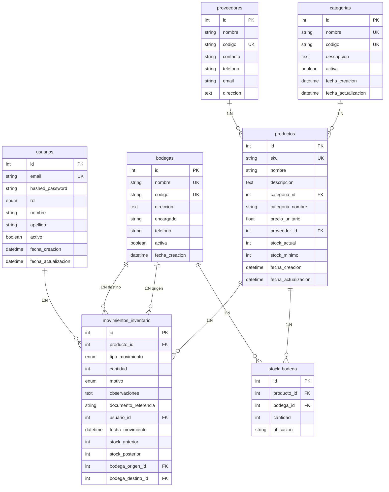
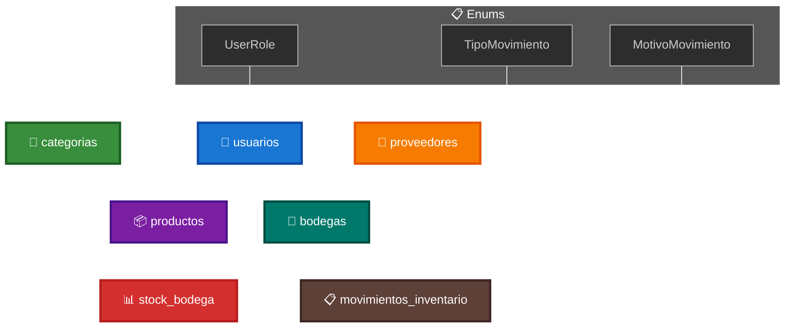
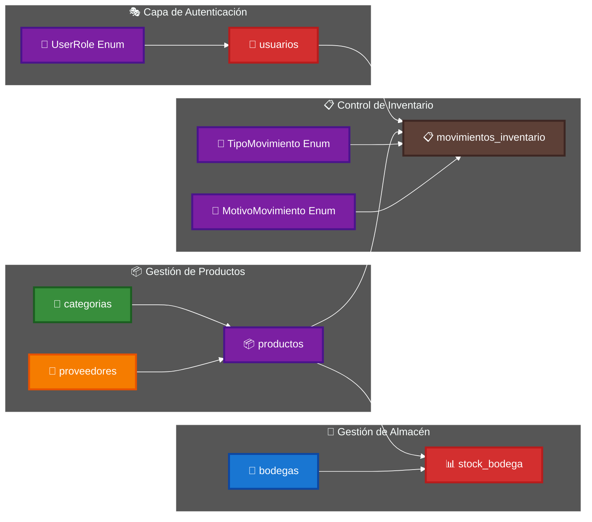
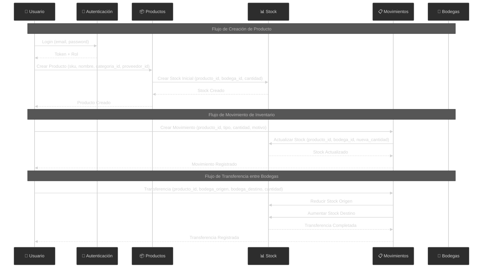
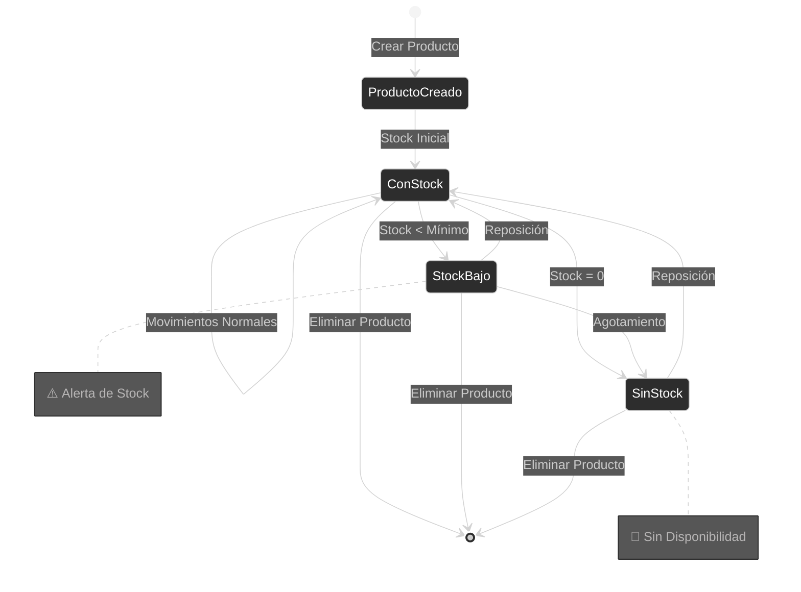

# 📊 Diagrama UML - Esquema de Base de Datos SVT

## 🎯 Diagrama de Entidad-Relación Principal

## 📋 Enums del Sistema

### **🎭 UserRole**
- `ADMIN` - Administrador con acceso completo
- `USUARIO` - Usuario regular con permisos limitados
- `INVITADO` - Usuario invitado con acceso de solo lectura

### **🔄 TipoMovimiento**
- `ENTRADA` - Entrada de productos al inventario
- `SALIDA` - Salida de productos del inventario
- `AJUSTE_POSITIVO` - Ajuste que aumenta el stock
- `AJUSTE_NEGATIVO` - Ajuste que reduce el stock
- `TRANSFERENCIA_ENTRADA` - Transferencia recibida
- `TRANSFERENCIA_SALIDA` - Transferencia enviada
- `INVENTARIO_INICIAL` - Inventario inicial del sistema
- `INVENTARIO_FISICO` - Conteo físico de inventario

### **📝 MotivoMovimiento**
- `COMPRA` - Compra de productos
- `VENTA` - Venta de productos
- `DEVOLUCION_CLIENTE` - Devolución de cliente
- `DEVOLUCION_PROVEEDOR` - Devolución a proveedor
- `AJUSTE_STOCK` - Ajuste manual de stock
- `CONTEO_FISICO` - Conteo físico
- `PRODUCTO_DANADO` - Producto dañado
- `PRODUCTO_VENCIDO` - Producto vencido
- `ERROR_SISTEMA` - Error del sistema
- `ROBO_PERDIDA` - Robo o pérdida
- `TRANSFERENCIA` - Transferencia entre bodegas
- `OTRO` - Otros motivos

## 🔄 Diagrama de Flujo de Relaciones

## 🏗️ Arquitectura del Sistema

## 🔄 Flujo de Operaciones del Sistema

## 📊 Diagrama de Estados de Productos

## 🎯 Diagrama de Casos de Uso

```mermaid
%%{init: {'theme':'dark', 'themeVariables': { 'primaryColor': '#ff6b6b', 'primaryTextColor': '#ffffff', 'primaryBorderColor': '#ff6b6b', 'lineColor': '#ffffff', 'secondaryColor': '#4ecdc4', 'tertiaryColor': '#45b7d1', 'background': '#1a1a1a', 'mainBkg': '#2d2d2d', 'secondBkg': '#3d3d3d', 'tertiaryBkg': '#4d4d4d'}}}%%
graph TB
    subgraph "👤 Actores"
        A[Administrador]
        B[Usuario Regular]
        C[Invitado]
    end

    subgraph "🎭 Gestión de Usuarios"
        D[Crear Usuario]
        E[Editar Usuario]
        F[Eliminar Usuario]
        G[Cambiar Rol]
    end

    subgraph "📦 Gestión de Productos"
        H[Crear Producto]
        I[Editar Producto]
        J[Eliminar Producto]
        K[Ver Productos]
    end

    subgraph "📊 Gestión de Inventario"
        L[Ver Stock]
        M[Crear Movimiento]
        N[Actualizar Stock]
        O[Transferir entre Bodegas]
    end

    subgraph "📋 Reportes"
        P[Reporte de Stock]
        Q[Kardex de Producto]
        R[Alertas de Stock]
    end

    A --> D
    A --> E
    A --> F
    A --> G
    A --> H
    A --> I
    A --> J
    A --> K
    A --> L
    A --> M
    A --> N
    A --> O
    A --> P
    A --> Q
    A --> R

    B --> K
    B --> H
    B --> I
    B --> L
    B --> M
    B --> N
    B --> O
    B --> P
    B --> Q
    B --> R

    C --> K
    C --> L

    style A fill:#d32f2f,stroke:#b71c1c,stroke-width:3px,color:#ffffff
    style B fill:#388e3c,stroke:#1b5e20,stroke-width:3px,color:#ffffff
    style C fill:#1976d2,stroke:#0d47a1,stroke-width:3px,color:#ffffff
```

## 📋 Descripción de Relaciones

### **Relaciones Principales:**

1. **Categorías → Productos** (1:N)
   - Una categoría puede tener muchos productos
   - Un producto pertenece a una categoría (opcional)
   - Campo: `productos.categoria_id` → `categorias.id`

2. **Proveedores → Productos** (1:N)
   - Un proveedor puede suministrar muchos productos
   - Un producto tiene un proveedor obligatorio
   - Campo: `productos.proveedor_id` → `proveedores.id`

3. **Productos ↔ Bodegas** (N:M a través de StockBodega)
   - Un producto puede estar en múltiples bodegas
   - Una bodega puede contener múltiples productos
   - Tabla intermedia: `stock_bodega`

4. **Productos → MovimientosInventario** (1:N)
   - Un producto puede tener múltiples movimientos
   - Cada movimiento afecta un producto específico
   - Campo: `movimientos_inventario.producto_id` → `productos.id`

5. **Usuarios → MovimientosInventario** (1:N)
   - Un usuario puede realizar múltiples movimientos
   - Cada movimiento es registrado por un usuario
   - Campo: `movimientos_inventario.usuario_id` → `usuarios.id`

6. **Bodegas → MovimientosInventario** (1:N - Doble relación)
   - Bodega origen: `movimientos_inventario.bodega_origen_id` → `bodegas.id`
   - Bodega destino: `movimientos_inventario.bodega_destino_id` → `bodegas.id`

## 🔍 Índices y Restricciones

### **Índices Únicos:**
- `usuarios.email`
- `categorias.nombre`
- `categorias.codigo`
- `proveedores.codigo`
- `bodegas.nombre`
- `bodegas.codigo`
- `productos.sku`
- `stock_bodega(producto_id, bodega_id)` - Índice compuesto único

### **Índices de Búsqueda:**
- `usuarios.email`
- `categorias.nombre`
- `categorias.codigo`
- `proveedores.nombre`
- `proveedores.codigo`
- `productos.nombre`
- `productos.sku`
- `productos.categoria_nombre`

## 🎯 Características Especiales

### **Campos de Auditoría:**
- `fecha_creacion`: Timestamp automático al crear
- `fecha_actualizacion`: Timestamp automático al actualizar

### **Campos de Estado:**
- `usuarios.activo`: Control de usuarios activos/inactivos
- `categorias.activa`: Control de categorías activas/inactivas
- `bodegas.activa`: Control de bodegas activas/inactivas

### **Compatibilidad:**
- `productos.categoria_nombre`: Campo redundante para compatibilidad con consultas existentes

### **Enums:**
- **UserRole**: ADMIN, USUARIO, INVITADO
- **TipoMovimiento**: 8 tipos de movimientos de inventario
- **MotivoMovimiento**: 12 motivos para movimientos

## 📊 Resumen de Tablas

| Tabla | Registros Estimados | Propósito |
|-------|-------------------|-----------|
| `usuarios` | 10-100 | Gestión de usuarios y autenticación |
| `categorias` | 10-50 | Clasificación de productos |
| `proveedores` | 20-200 | Gestión de proveedores |
| `bodegas` | 5-20 | Ubicaciones de almacenamiento |
| `productos` | 100-10,000 | Catálogo de productos |
| `stock_bodega` | 500-50,000 | Stock por bodega |
| `movimientos_inventario` | 1,000-100,000 | Historial de movimientos |

## 🚀 Optimizaciones Implementadas

1. **Índices estratégicos** para consultas frecuentes
2. **Campos nullable** donde es apropiado
3. **Valores por defecto** para campos comunes
4. **Timestamps automáticos** para auditoría
5. **Enums** para valores controlados
6. **Relaciones bidireccionales** con SQLAlchemy
7. **Índices compuestos** para consultas complejas
